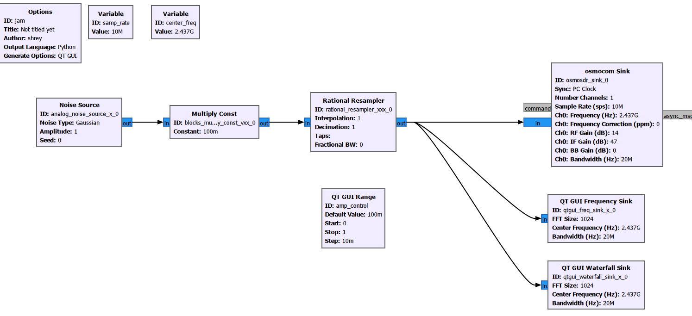
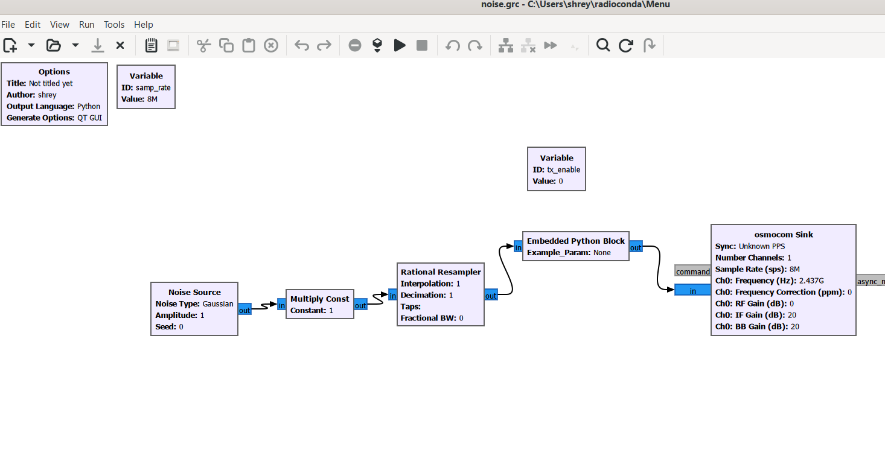
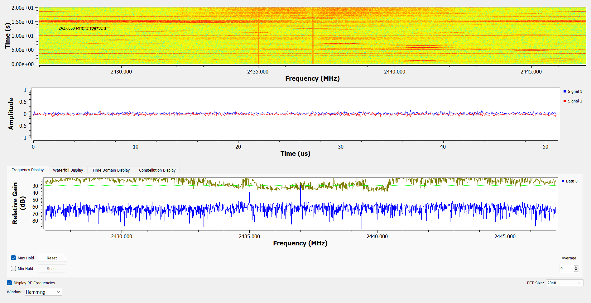
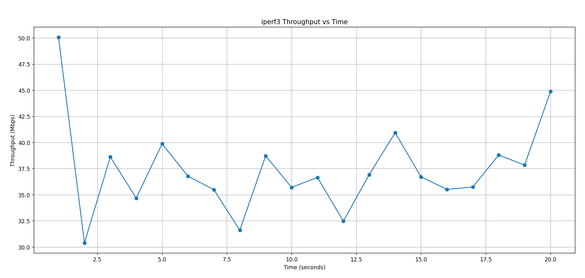
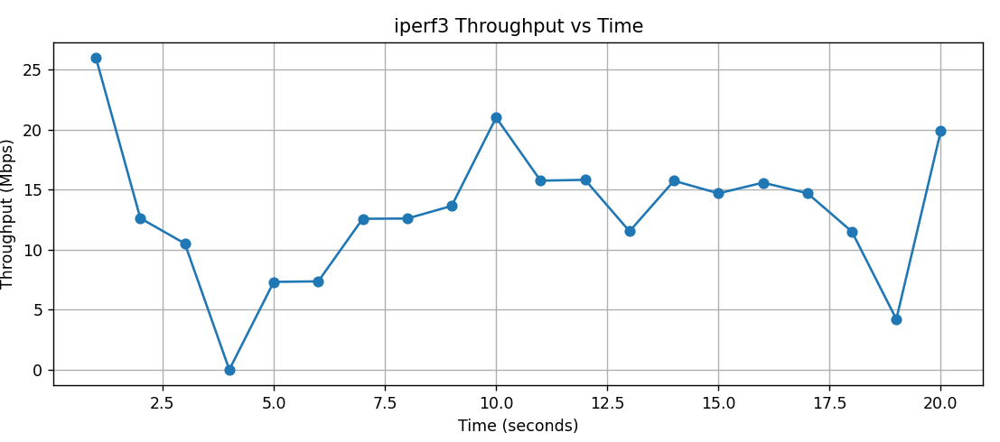
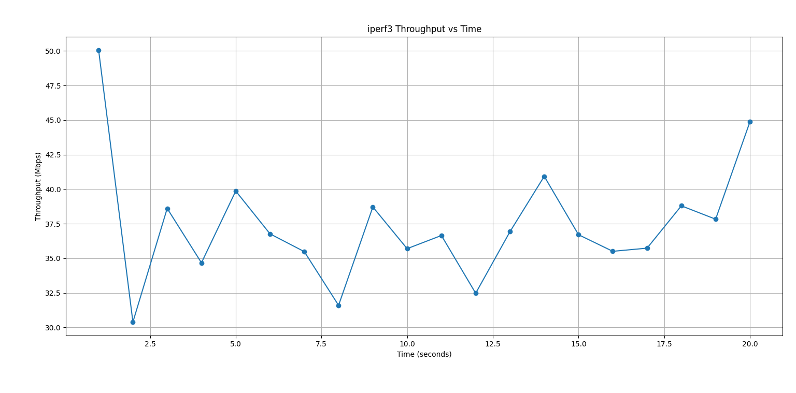

# RF Gain Controlled Wi-Fi Interference Using HackRF One

## 📝 Overview
This project investigates the effect of controlled RF noise on Wi-Fi performance using Software Defined Radio (SDR). A HackRF One device is used to generate band-limited Gaussian noise to analyze signal degradation and throughput reduction. 

It demonstrates the real-world impact of RF interference on standard 2.4 GHz Wi-Fi connections, serving as an educational showcase on interference analysis and network robustness testing.

> **Note:** The core operational RF transmission code is not included in this repository for security and safety purposes. Only non-sensitive elements like result parsing scripts (`live_iperf_graph.py`) and performance data graphs are provided to validate the research.

---

## 🛠 Hardware & Software Required

### Hardware
- **HackRF One SDR**: Used to generate targeted RF noise.
- **2.4 GHz Antenna**
- **Wi-Fi Router & Client Device**: Targets for the throughput study.
- **Shielded Environment**: (Recommended for controlled testing).

### Software
- **GNU Radio**: For DSP and noise generation flowgraphs.
- **Python & Matplotlib**: To parse logs and plot performance decay.
- **iperf3**: To measure real-time Wi-Fi throughput.

---

## ⚙ Methodology

1. **Establish Baseline:** Create a stable Wi-Fi connection and measure ideal throughput.
2. **GNU Radio Setup:** Deploy the noise generation flowgraph with the HackRF One acting as a transmitter. 
3. **Controlled Interference:** Gradually increase the RF gain to emit Gaussian noise in the 2.4 GHz spectrum.
4. **Data Collection:** Use `iperf3` to log the network throughput as interference scales.
5. **Analysis:** Run the included `live_iperf_graph.py` to plot throughput degradation and SNR estimates.

---

## 📊 Visuals & Workflow

### 1. GNU Radio Flowgraph for Noise Generation
*(The design used to emit controlled noise using HackRF One)*

### 2. Experimental Setup & Captures
*(Various captures during the analysis of the interference)*

---

## 📈 Results

By adjusting the RF gain and emitting targeted noise, the network performance degraded predictably.
Below is the outcome mapped by the `live_iperf_graph.py` logic, demonstrating how the connection responds to active RF interference:

**Key Findings:**
- Throughput decreases with increasing RF noise.
- Signal-to-Noise Ratio (SNR) reduces significantly as HackRF gain is staged up.
- Validates the susceptibility of standard wireless protocols to external RF swamping.

---

## 🚀 Future Work
- Adaptive interference generation mapping.
- Multi-band analysis targeting 5GHz.
- Real-time visualization optimizations.

---

## 👨‍💻 Author
**Shreyansh Khandelwal**  
*Electronics and Communication Engineering*
